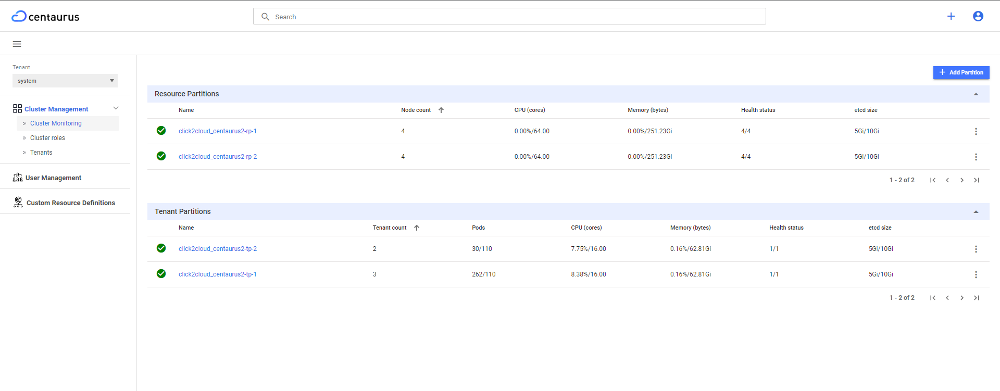
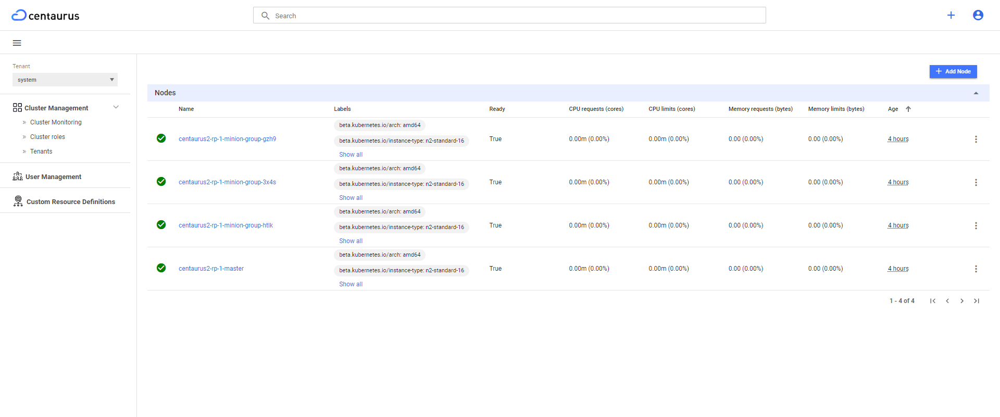
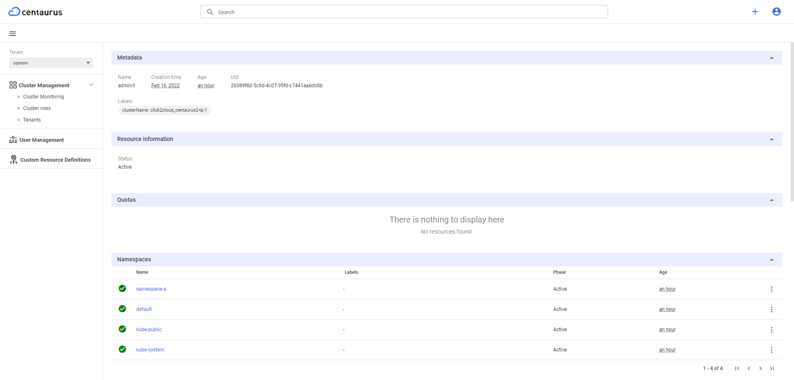

# Centaurus Portal Requirement & Design

**Author(s)**: [Click2Cloud Inc](https://github.com/Click2Cloud-Centaurus)

This design document is a proposal for enhancing the dashboard UI that
allows users to manage Centaurus Cluster, Tenants, Users, and
Quotas in an intuitive way.

## Goals
* Manage Centaurus Cluster
* Manage multiple TPs and RPs using dashboard (by enabling client to fetch details from all TPs and RPs)
* Enable user to login using username and password (instead of token)
* Add tenant management feature
* Add user management feature
* Provide cluster monitoring (All TPs and RPs)
* Workload management (VM, Pods, Deployments, Services, etc)
* VM workload management
* Add quota management feature

## Background
Below details can be obtained by the cluster admin and tenant admin using CLI (i.e. using `kubectl` utility) :
* Tenant partition detail
* Resource partition detail
* Tenant Management
* Cluster role and role CRUD operation
* User Management
* Quota CRUD operation
* Namespace CRUD operation
* Role CRUD operation
* Cluster Monitoring
* VM workload management

None of these are reflected in the current version of Dashboard UI. User will need a simplified, more user-friendly way to manage the cluster, tenants, users and workloads.

## Overview

### User Management
Centaurus cluster will have a default cluster admin(Username:`centaurus` and password: `Centaurus@123`) which will get created automatically while setting up dashboard service.

#### IAM service details
IAM service is a service that manages users, roles, and permissions.
This service will be used to manage Centaurus user's username and password which will get store in postgreSQL database.
Internally , IAM service will map a token to  username and password for a user.


### Cluster admin profile
Cluster admin can perform following operation using Dashboard UI:
* Create tenant along with tenant admin
* Create tenant admin for any tenant
* Create supported cluster admin user
* Delete tenant
* List all tenant
* List any user
* Delete any user
* Get details of all tenant partition and resource partition
* Monitor health checks & resource utilization for each and every partition
* Create RBAC roles and role bindings
* Manage CRDs

#### Tenant Creation
When user will create a new tenant, dashboard service will create a tenant admin for that tenant with username and password provided by cluster admin user.

Following YAML is being used to create Cluster admin
```bigquery
apiVersion: v1
kind: ServiceAccount
metadata:
  name: cluster-admin
  namespace: default
---
apiVersion: rbac.authorization.k8s.io/v1
kind: ClusterRoleBinding
metadata:
  name: cluster-admin
subjects:
  - kind: ServiceAccount
    name: cluster-admin
    namespace: default
    apiGroup: ""
roleRef:
  kind: ClusterRole
  name: cluster-admin
  apiGroup: rbac.authorization.k8s.io
```


### Tenant admin profile
Tenant admin is tenant scoped user, who can perform operations on specific tenant. Tenant admin can perform following operation using Dashboard UI:
* Create,List and Delete supported tenant admin user for that tenant
* Create and delete tenant user within that tenant
* Monitor health checks & resource utilization for its own respective tenant within the Centaurus cluster
* Namespace operation for that tenant
* Role operation for that tenant
* Manage namespace quotas for a tenant
* Manage resources within a tenant
* Manage CRDs within a tenant

Following YAML is being used to create tenant admin
```bigquery
apiVersion: v1
kind: Namespace
metadata:
  tenant: tenant-admin
  name: default
---
apiVersion: v1
kind: ServiceAccount
metadata:
  tenant: tenant-admin
  name: tenant-admin
  namespace: default
---
apiVersion: rbac.authorization.k8s.io/v1
kind: ClusterRole
metadata:
  tenant: tenant-admin
  name: tenant-admin
  namespace: default
rules:
  - apiGroups: ["*"]
    resources: ["*"]
    verbs: ["*"]
---
apiVersion: rbac.authorization.k8s.io/v1
kind: ClusterRoleBinding
metadata:
  name: tenant-admin
  tenant: tenant-admin
  namespace: default
subjects:
  - kind: ServiceAccount
    name: tenant-admin
    namespace: default
    apiGroup: ""
roleRef:
  kind: ClusterRole
  name: tenant-admin
  apiGroup: rbac.authorization.k8s.io
```


### Tenant user profile
Tenant user is namespace scoped user that can perform following operation using Dashboard UI:
* Application deployment within a namespace
* VM workload management within a namespace
* Monitoring and resource utilization according to RBAC

YAML for tenant user
```bigquery
apiVersion: v1
kind: Namespace
metadata:
  name: user-namespace
  tenant: tenant-name
---
apiVersion: v1
kind: ServiceAccount
metadata:
  name: tenant-user
  namespace: user-namespace
  tenant: tenant-name
---
apiVersion: rbac.authorization.k8s.io/v1
kind: RoleBinding
metadata:
  name: tenant-user
  namespace: user-namespace
  tenant: tenant-name
subjects:
  - kind: ServiceAccount
    name: tenant-user
    namespace: user-namespace
    apiGroup: ""
roleRef:
  kind: Role
  name: tenant-user
  apiGroup: rbac.authorization.k8s.io
```


### Dashboard client modification

Earlier dashboard go-client was able to connect to only one api-server of Arktos cluster, the modified dashboard client will be able to communicate to multiple api-server which allow dashboard service to fetch all details of all RPs and TPs.

## Dashboard detailed Design

##### 1. Login Page
User will be able to login to dashboard using username and password.


##### 2. Cluster Monitoring

* List of all the partitions available


###### Enable multi-config support in dashboard client:

In centaurus cluster, for 2TP and 2RPs cluster, user will have 4 configs. So dashboard's client can connect to respective API server(respective TP) in which that tenant is located.
For eg. if we have 2TPs and 2RPs cluster, then all tenants with prefix between `a` to `m` will get created in TP1 and tenants with prefix between `n` to `z` will get created in TP2.



* Inside Resource Partition details, user will be able see the details of all nodes and resources



* Inside Tenant Partition details, user will be able see the details of all the tenants.




##### 3. Tenant Monitoring for tenant admin
* Tenant admin will be able to see the details of all the resources created within that tenant.


##### 4. Tenant Operation
***List Tenants***


***Create Tenant Admin operation***


##### 5. User Management

* List of all the users created


##### 6. Tenant admin overview page


##### 7. Managing Namespace
* List of all Namespaces created


##### 8. Access Control
***Roles and Cluster roles***


##### 9. Managing Quotas
* List of quotas for a tenant


* Tenant admin can manage quota for different namespaces within a tenant and also Tenant admin can update the quota assigned to a tenant


##### 9. Tenant User 

* Create a new tenant user


* Tenant user overview page


* VM workload management


### Developement Portal Link

***Link***: [Centaurus Portal](https://35.193.138.94:30001/#/login)

***Username***: `centaurus`

***Password***: `Centaurus@123`
