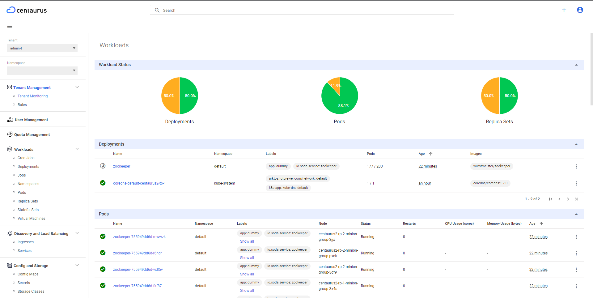

# Centaurus Portal
This design document is a proposal for enhancing the dashboard UI that
allows users to manage Centaurus Cluster, Tenants, Users, and
Quotas in an intuitive way.

## Goals 
Following are the added features in Centaurus portal(Dashboard UI):
* Manage Centaurus Cluster
* Enable user to login using username and password (instead of token)
* Cluster management
* Tenant management
* User management
* Monitoring
* Managing:
  * Quota
  * Namespace
  * Roles
  * Cluster Role

## Background
Below operations can be modified by the cluster admin using CLI (i.e. using `kubectl` utility) :
* CRUD operations can be performed for:
  * Tenant
  * Namespace
  * Roles
  * Cluster Role
  * Quota
  * Users

Currently, APIs for Resource Partition and Tenant Partition tabs under Cluster Monitoring are unavailable.
None of these are reflected in the current version of Dashboard UI. There should be a simplified, more user-friendly way to manage the cluster, tenants and users.

## Overview
### User Management

### Cluster admin profile
Cluster admin can perform following operation using Dashboard UI:
* Create tenant
* Delete tenant
* List tenant
* Create tenant admin
* Monitor health checks & resource utilization for each and every partition
* Create RBAC roles and role bindings for other fine-grained cluster admins

### Tenant admin profile
Tenant admin can perform following operation using Dashboard UI:
* Creating other fine-grained tenant admins and regular tenant users
* Monitor health checks & resource utilization for its own respective tenant within the Centaurus cluster
* List/create/delete  tenant users
* Create RBAC roles and role bindings in the tenant
* Manage namespace quotas for a tenant

### Tenant user profile
Tenant user can perform following operation using Dashboard UI:
* Application deployment
* Monitoring and resource utilization according to RBAC

## Feature details
___
#### 1. IAM service details
IAM service is a service that manages users, roles, and permissions.
This service will be used to manage Centaurus user's username and password.
###### API added
* Create User(Cluster admin/Tenant admin/Tenant user)
* List all users
* Get details of specific user
* Delete user

#### 2. Tenant Admin Creation

At the time of a tenant creation by *Cluster admin*, a default tenant admin user will be created inside the newly created tenant. Once done, the default tenant admin can do everything inside the tenant without turning to cluster admin for any tenant management functions.

#### 3. Tenant User Creation
For a tenant, a user can be created. Tenant user can work on specific namespace within the tenant.

#### 4. Cluster Monitoring
* Cluster admin can monitor health checks & resource utilization for each and every partition
* Tenant admin can monitor health checks & resource utilization for its own respective tenant within the Centaurus cluster
* Tenant user can monitor health checks & resource utilization according to RBAC

###### API developed in Dashboard backend
* To get details of Tenant Partition
* To get details of Resource Partition

### Dashboard detailed Design

##### 1. Login Page

##### 2. Cluster Monitoring
* List of all the partitions available

* Inside Resource Partition details, user will be able see the details of all nodes and resources

* Inside Tenant Partition details, user will be able see the details of all the tenants.

##### 3. Tenant Monitoring
* It will show details of all resources within a tenant

##### 4. Tenant Operation
***List Tenants***

***Create Tenant Admin operation***

##### 5. Managing Namespace
* List of all Namespaces created

##### 6. Access Control
***Roles and Cluster roles***

##### 7. Managing Quotas
* List of quotas for a tenant

* Tenant admin can manage quota for different namespaces within a tenant and also Tenant admin can update the quota assigned to a tenant

##### 7. User Management

* List of all the users created

* Create a new user

### Developement Portal Link

***Link***: [Centaurus Portal](https://146.148.106.48:9443/#/login)

***Username***: `centaurus`

***Password***: `Centaurus@123`
