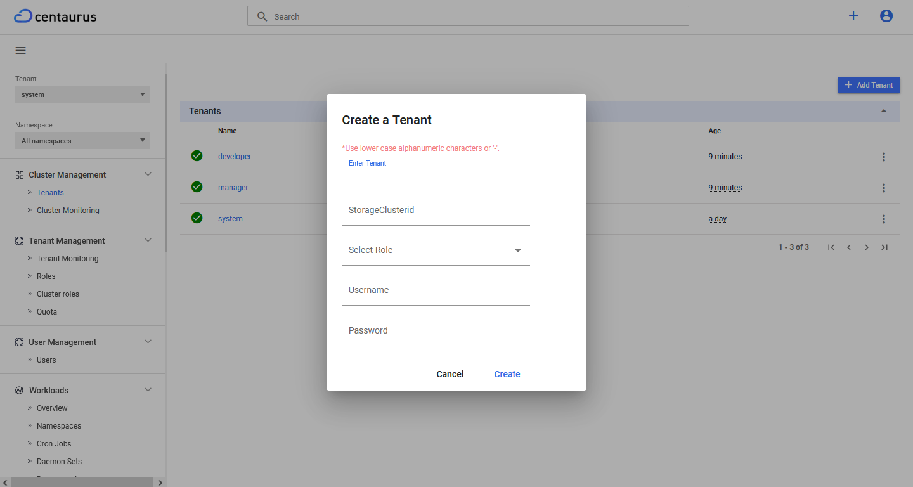

# Centaurus Portal
This design document is a proposal for enhancing the dashboard UI that
allows users to manage Centaurus Cluster, Tenants, Users, and
Quotas in an intuitive way.

## Goals Achieved
Following are the added features in Centaurus portal(Dashboard UI):
* Manage Centaurus Cluster
* Enable user to login using username and password (instead of token)
* Cluster management
* Tenant management
* User management
* Monitoring
* Managing:
  * Quota
  * Namespace
  * Roles
  * Cluster Role

### Non-goals
TBA

## Background
Below operations can be modified by the cluster admin using CLI (i.e. using `kubectl` utility) as well as dashboard UI:
* CRUD operations can be performed for:
  * Tenant
  * Namespace
  * Roles
  * Cluster Role
  * Quota
  * Users
  * Service account

Currently, APIs for Resource Partition and Tenant Partition tabs under Cluster Monitoring are unavailable.

### Assumptions and Constraints
TBA

## Overview
### User Management

### Cluster admin profile
Cluster admin can perform following operation using Dashboard UI:
* Create Tenant
* Delete Tenant
* List Tenant
* Monitor health checks & resource utilization for each and every partition
* Reconfigure Cluster Partitions
* Create RBAC roles and role bindings for other fine-grained cluster admins

### Tenant admin profile
Tenant admin can perform following operation using Dashboard UI:
* Creating other fine-grained tenant admins and regular tenant users
* Monitor health checks & resource utilization for its own respective tenant within the Centaurus cluster
* List/create/delete users
* Create RBAC roles and role bindings in the tenant
* Manage namespace quotas for a tenant

### Tenant user profile
Tenaent user can perform following operation using Dashboard UI:
* Application deployment
* Monitoring and resource utilization according to RBAC

## Feature details
___
#### 1. IAM service details
IAM service is a service that manages users, roles, and permissions.
This service will be used to manage Centaurus user's username and password.
###### API Used
* Create User
* Get User
#### 2. Create Tenant Operation

At the time of a tenant creation by *Cluster admin*, a default tenant admin user will be created inside the newly created tenant. Once done, the default tenant admin can do everything inside the tenant without turning to cluster admin for any tenant management functions.

###### API Used
* Create Tenant
* Create Roles and Role binding

###### Work Flow

#### 3. Create Tenant User Operation
Step 1: Create a tenant

Step 2: Create a Role, Service account and Role binding

Step 3: Get token for the user that has already been mapped with the username and password.

#### 4. Cluster Monitoring
* Cluster admin can monitor health checks & resource utilization for each and every partition
* Tenant admin can monitor health checks & resource utilization for its own respective tenant within the Centaurus cluster
* Tenant user can monitor health checks & resource utilization according to RBAC

###### API to be developed in Dashboard backend
* Tenant Partition (Create & Get)
* Resource Partition (Create & Get)

### Detailed Design

##### 1. Login Page

##### 2. Cluster Monitoring
* List of all the partitions available

* It will show details of all nodes and resources

* It will show list and details of all tenants

##### 3. Tenant Monitoring
* It will show details of all resources within a tenant

##### 4. Tenant Operation
***List Tenants***

***Create Tenant***

***Delete Tenant***

##### 5. Managing Namespace
* List of all Namespaces created

* Create a new namespace

##### 6. Access Control
***Roles and Cluster roles***

##### 7. Managing Quotas
* List of quotas for a tenant

* Tenant admin can assign quota to a tenant

* Tenant admin can update the quota assigned to a tenant

##### 7. User Management

* List of all the users created

* Create a new user

### Developement Portal Link

***Link***: [Centaurus Portal](https://35.209.119.154:30001/#/login)

***Username***: `admin`

***Password***: `password`
